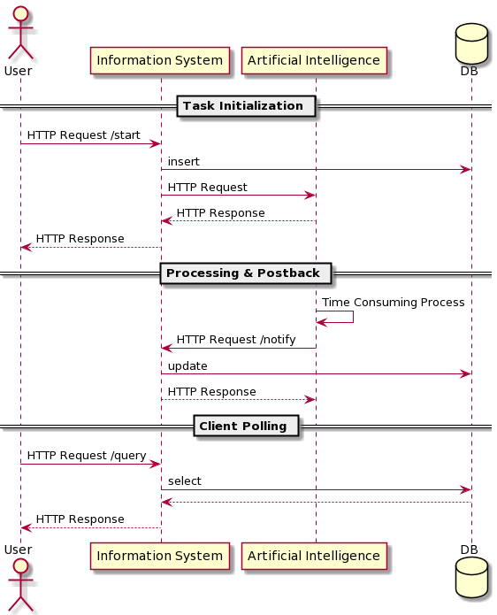

# eku-intelligent-services
Intelligent Services Course at Eszterhazy Karoly University

__Goal:__ The project gives and example for extension of a simple information system with intelligence using asynchronous processing and a micro service architecture. 

__See also:__
 - [MERN Project Example](https://github.com/ZsoltToth/project-templates-mern)
 - [Artificial Intelligence](https://github.com/ZsoltToth/artificial-intelligence)

# Architecture

## Information System 

Technologies:
 - NodeJS, Express
 - MongoDB, Mongoose
 - Swagger

## Intelligent Service / Artificial Intelligence

Technologies:
 - Python

# Contribution

## Coding Guidelines

### JavaScript
 - ESLint was configured for information system
 - Husky prevents committing code with style violations.
 - Jest is used for testing but quality gate is not set (yet).

 ### Python
  - PyLint shall be used
  
# Notes / Known Issues
 - Docker compose may cache some build steps, such as, Pipfile so --no-cache option may be necessary during build.

